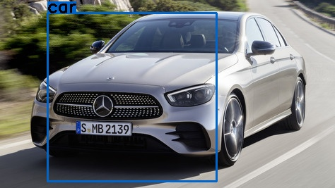

# Object Detection with Cascade Classifier

## Objective

Cascade Classifier of OpenCV includes two major stages: training and detection.
It is a good method for face detection, eye detection, face expression and fatigue recognition.
But here I wanna use it for vehicle detection and see how it works.

## Dependencies & Environment
* Python 3.6
* OpenCV 3.4.10
* Ubuntu 16.04

## Pipeline

### 1. Install OpenCV

we need to install OpenCV(3.x) manually on PC, 
then we will get the tools for cascade classifier in "../opencv-3.x/build/bin": 
* [opencv_createsamples.exe](./detector/data/opencv_createsamples)
* [opencv_traincascade.exe](./detector/data/opencv_traincascade)

### 2. Prepare data

#### 2.1 Get dataset

For training we need two types of samples: negative and positive. 
Negative samples correspond to non-object images.
Positive samples correspond to images with detected objects.
Samples should meet follow conditions:
* as many as possible
* negative samples should be at least 3 times (better 5 times) more than positive samples

#### 2.2 Normalize sample size

All samples should be converted to grayscale. 
Size of positive samples should be normalized to 24x24 or else..., but not too large.
There is no need to normalize the size of negative samples, 
but they must be larger than positive samples' size.
* [normalization.py](./detector/normalization.py) is a tool for normalization.
* save all normalized positive samples in directory /pos
* save all normalized negative samples in directory /neg

#### 2.3 Create txt file

* **ls -rt pos > pos.txt**  # contains positive samples' name
* change all names into the same format, like: **pos/12345.jpg 1 0 0 24 24**  
* **ls -rt neg > neg.txt**  # contains negative samples' name
* change all names into the same format, like: **neg/12345.jpg**

#### 2.4 Create vec file

opencv_createsamples -info pos.txt -vec pos.vec -bg neg.txt -num 1500 -w 24 -h 24

### Train cascade

opencv_traincascade -data xml -vec pos.vec -bg neg.txt -numPos 1000 -numNeg 5000 -numStages 20 
-featureType HAAR -w 24 -h 24 -minHitRate 0.995 -maxFalseAlarmRate 0.5 -mode ALL

* -numPos: Number of positive samples used in training for every classifier stage, 
**must less than the total number of positive samples**.

* -numNeg: Number of negative samples used in training for every classifier stage, 
**could larger than the total number of negative samples**.

After training we get the XML cascade classifier: [cascade.xml](./detector/data/xml/cascade.xml).

### Test cascade classifier

Please see [detection.py](./detection.py). 

### Conclusion

* Cascade classifier works really fast, it can be used in situations 
where we have low computational power and we do not want to compromise on the speed.
* However, it works not so well in complex situations, such as vehicles detection in heavy streets, 
because the accuracy is not so good. Of course, the accuracy depends on the training data, 
if we have a very large set of training data with high quality, the accuracy would be much better.
* For better accuracy we could use deep learning algorithm instead, such as YOLO.

